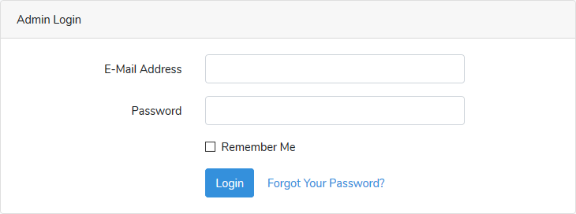

# PaP (People and Phones)
**Version:** V2.1.0 
**Team Name:** PaP 
**Team ID:** A17-Fri 
**Team Members:**
- Brenton Holloway
- Mark Todio
- Brigitta Hega
- Larry Ho
**********
- [PaP (People and Phones)](#pap-people-and-phones)
  - [User](#user)
    - [User Login](#user-login)
    - [Home](#home)
      - [Guest](#guest)
      - [Logged In User](#logged-in-user)
      - [Logged In Admin](#logged-in-admin)
    - [Profile](#profile)
    - [Phones](#phones)
    - [Phone Requests](#phone-requests)
    - [Messages *`(Not Yet Implemented)`*](#messages-not-yet-implemented)
  - [Administrator](#administrator)
    - [Admin Login](#admin-login)
      - [Forgot your password](#forgot-your-password)
    - [Home *`(Not Yet Implemented)`*](#home-not-yet-implemented)
    - [Settings](#settings)
      - [Profile Settings](#profile-settings)
    - [Users](#users)
      - [Accounts](#accounts)
      - [phones](#phones)
    - [Administrators](#administrators)
    - [phones](#phones-1)
    - [Messages *`(Not Yet Implemented)`*](#messages-not-yet-implemented-1)
  - [Search](#search)

## User
### User Login

To log in as a user go to /login and the user will be presented with a login form. after logging in the user will be redirected to their dashboard (/home). If the user tries to access their /home before logging in the user will be redirected to the login page.

If the user clicks `Forgot Your Password` they will be redirected to the following page where they will be required to input their email. After this the user will be emailed a unique link to reset their password.

### Home

The homepage shows a list of the 10 most resently listed phones

#### Guest

#### Logged In User

#### Logged In Admin

### Profile

### Phones

### Phone Requests

A user can create a phone request by going to /phone-requests and clicking on the `new request` button.

### Messages *`(Not Yet Implemented)`*

## Administrator
### Admin Login

To log in as an admin go to /admin/login and the user will be presented with a login form. After loggin in the user will be redirected to their dashboard (/admin). If the user tries to access their /admin before loggin in the user will be redirected to the admin login page.

#### Forgot your password
If the administrator clicks `Forgot Your Password` they will be redirected to the following page where they will be required to input their email. After this the administrator will be emailed a unique link to reset their password.

### Home *`(Not Yet Implemented)`*

The home page will consist of a massage feed of items that have been flagged, messages from users and errors/warnings that need attention.

### Settings

#### Profile Settings
Here the administrator will be able to update their profile image (avatar), name and other details

### Users

#### Accounts
Here the administrator will be able to see and search all subscribed users. They will also be able to add, remove and suspend user accounts. They will also be able to send users a reset password request to the user.

#### phones
The administrator will also be able to see the phones that each of the users currently have for sale and will be able to monitor the phones. e.g. they will be able to remove any unauthorized phones and take the appropriate disciplinary action.

### Administrators

Here the administrator will be able to see all current administrator and will be able to add, remove administrator accounts. The Administrators page is accessed via the administrator dashboard. To login to the administrator dashboard see: [Admin Login](#admin-login)

### phones

Here the administrator will be able to see all the phone that are currently for sale on the web application.

### Messages *`(Not Yet Implemented)`*

Here the administrator will be able to send and receive messages for users and other administrators.

## Search
The search for the application uses TNT search driver with the Laravel scout wrapper. TNTSearch is a fully featured full text search engine written entirely in PHP. It's simple configuration allows you to add an amazing search experience to your site in just minutes.  
[TNT Search Driver README.md](https://github.com/teamtnt/laravel-scout-tntsearch-driver/blob/master/README.md)  
[TNT Search README.md](https://github.com/teamtnt/tntsearch/blob/master/README.md)

**********

Github Url: https://github.com/rmit-s3604775-mark-todio/PaP

AWS Deployment: http://peopleandphones-env.pum4zqwj55.us-east-2.elasticbeanstalk.com

AWS DRS Connection Details=
Endpoint: aaav69ar1erlb3.cagfobn23fqn.us-east-2.rds.amazonaws.com

Port: 3306

Username: root

Password: 7hvwaEG7q0jxi3vt
