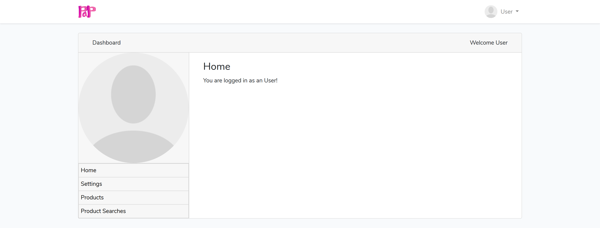
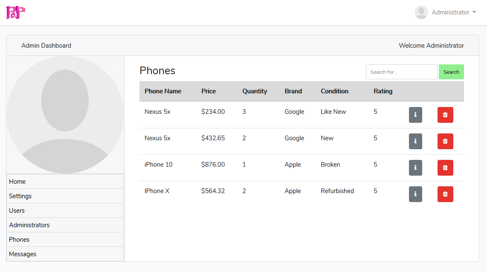

# PaP (People and Phones)
**Version:** alpha-1.0.0 
**Team Name:** PaP 
**Team ID:** A17-Fri 
**Team Members:**
- Brenton Holloway
- Mark Todio
- Brigitta Hega
- Larry Ho
**********
- [PaP (People and Phones)](#pap-people-and-phones)
  - [User](#user)
    - [User Login](#user-login)
    - [Home](#home)
    - [Profile](#profile)
    - [Products](#products)
    - [Product Requests](#product-requests)
    - [Messages *`(Not Yet Implemented)`*](#messages-not-yet-implemented)
  - [Administrator](#administrator)
    - [Admin Login](#admin-login)
      - [Forgot your password](#forgot-your-password)
    - [Home *`(Not Yet Implemented)`*](#home-not-yet-implemented)
    - [Settings *`(Partial Implementation)`*](#settings-partial-implementation)
      - [Profile Settings](#profile-settings)
    - [Users *`(Not Yet Implemented)`*](#users-not-yet-implemented)
      - [Accounts](#accounts)
      - [Products](#products-1)
    - [Administrators](#administrators)
    - [Products *`(Not Yet Implemented)`*](#products-not-yet-implemented)
    - [Messages *`(Not Yet Implemented)`*](#messages-not-yet-implemented-1)
  - [Search](#search)

## User
### User Login

To log in as a user go to /login and the user will be presented with a login form. after logging in the user will be redirected to their dashboard (/home). If the user tries to access their /home before logging in the user will be redirected to the login page.

If the user clicks `Forgot Your Password` they will be redirected to the following page where they will be required to input their email. After this the user will be emailed a unique link to reset their password.

### Home

### Profile

### Products

### Product Requests

A user can create a product request by going to /product-requests and clicking on the `new request` button.

### Messages *`(Not Yet Implemented)`*

## Administrator
### Admin Login

To log in as an admin go to /admin/login and the user will be presented with a login form. After loggin in the user will be redirected to their dashboard (/admin). If the user tries to access their /admin before loggin in the user will be redirected to the admin login page.

#### Forgot your password
If the administrator clicks `Forgot Your Password` they will be redirected to the following page where they will be required to input their email. After this the administrator will be emailed a unique link to reset their password.

### Home *`(Not Yet Implemented)`*

The home page will consist of a massage feed of items that have been flagged, messages from users and errors/warnings that need attention.

### Settings *`(Partial Implementation)`*

#### Profile Settings
Here the administrator will be able to update their profile image (avatar), name and other details

### Users *`(Not Yet Implemented)`*

#### Accounts
Here the administrator will be able to see and search all subscribed users. They will also be able to add, remove and suspend user accounts. They will also be able to send users a reset password request to the user.

#### Products
The administrator will also be able to see the products that each of the users currently have for sale and will be able to monitor the products. e.g. they will be able to remove any unauthorized products and take the appropriate disciplinary action.

### Administrators

Here the administrator will be able to see all current administrator and will be able to add, remove administrator accounts. The Administrators page is accessed via the administrator dashboard. To login to the administrator dashboard see: [Admin Login](#admin-login)

### Products *`(Not Yet Implemented)`*

Here the administrator will be able to see all the product that are currently for sale on the web application.

### Messages *`(Not Yet Implemented)`*

Here the administrator will be able to send and receive messages for users and other administrators.

## Search
The search for the application uses TNT search driver with the Laravel scout wrapper. TNTSearch is a fully featured full text search engine written entirely in PHP. It's simple configuration allows you to add an amazing search experience to your site in just minutes.  
[TNT Search Driver README.md](https://github.com/teamtnt/laravel-scout-tntsearch-driver/blob/master/README.md)  
[TNT Search README.md](https://github.com/teamtnt/tntsearch/blob/master/README.md)